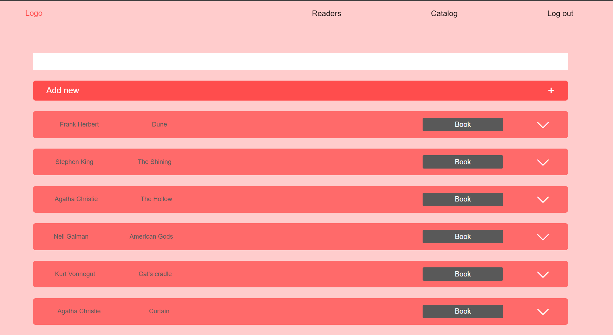

# Library system - Web Application
## Table of contents
* [General info](#general-info)
* [Running](#running)
* [Functionalities](#functionalities)
* [Technologies](#technologies)

## General info

Library system web application created as a recruitment task at Kinguin.
The task's requirements were : CRUD operations for books and customers and an endpoint to record whether the 
book has been borrowed.
The requirements are met and there have been more functionalities added.

## Running

Running the application is straightforward. Download the zip file from GitHub, extract the project and run LibrarysysApplication in the IDE. The application should be available on
port 8080. If your port 8080 is busy, you can change the port number in application.properties file.
```
server.port = DESIRED_PORT_NUMBER
```
The database is hosted in a cloud service and should connect automatically.

Once the application is running, you should go under localhost:portnumber/ as this is the main endpoint of the application.
Choose log in from the menu bar on the top of the page, or hit the LOG IN button on the right.
You will be transfered to the login page.

The application has 2 libarian accounts configured.
You can log in using one of those log in credentials:

<table>
  <colgroup>
    <col span="2">
    <col style="background-color:yellow">
  </colgroup>
  <tr>
    <th>Email</th>
    <th>Password</th>
  </tr>
<tr style="color:pink">
    <th>johndoe@gmail.com</th>
    <th>pass123</th>
</tr>
<tr style="color:aquamarine">
    <th>mariesmith@gmail.com</th>
    <th>password</th>
</tr>
</table>
After successfully logging in, you will be transferred to the panel, where most of the application's functionalities are located.

Navigate the application through the menu on the top of the panel, use the buttons to use the functionalities.

## Functionalities

Key functionalities:
* browse all the books in the library, viewing if the book is free for booking, or is borrowed
* browse all readers (customers) in the library
* add new readers
* add new books
* delete readers
* delete books
* make book reservations for readers
* return books
* see reader's information, currently borrowed books and borrowing history

In depth look at the application:

After logging in, you will be transferred to the Catalog view. You can log out, using the Log out option on the menu at the top,
or continue browsing using other options.

Catalog browsing:

If the book is borrowed, You will see the option "Return" on the button.

Click the Add new button on the top to see the option of adding a new book. 


Add a new book, clicking on "Add" button. Click on "Book" within the record, to see the option to book it.
If a "Return" button is visible instead of "Book", the book is borrowed. You may hit the "Return" button to return the book.

You can also hit the arrow on the left, to see book's id and the option to delete it.


Hit "Delete" to delete the book from the database.


After clicking the option "Book" on the book record, the option for booking this copy will appear. Provide user's library card and hit "Book".


Go to "Readers" on the top menu, to browse all the readers in the system.


Similarly to the catalog options, You may use "Add new" button, to add a new reader.

You may also delete the reader from the database, using "Delete" button.
View user details by hitting the "+" within the record.


You will see reader's name and surname, their library card number and the list of current borrowings 
in the red container at the top.
Each previous borrowing will be displayed in a separate container, with the borrowing and return date, book name and bookId visible.


## Technologies
Project built using:

* Java version 19, SDK: openjdk-21
* Spring version 3.3.1
* HTML5 + CSS3
* JavaScript
* MongoDB database - cloud-hosted MongoDB Atlas

The frontend was developed separately, you can see the whole process in [this repository](https://github.com/achwi00/libsys-front).

